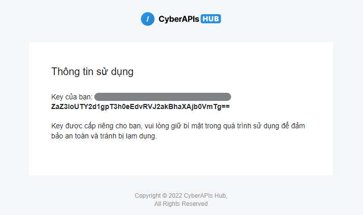

# CyberAPIs

**CyberAPIs** là nền tảng do chính **Cyber Eye** tự xây dựng nhằm cung cấp sản phẩm của Cyber Eye dưới dạng **API** (_Application Programming Interface_), giúp khách hàng và đơn vị đối tác có thể dễ dàng tích hợp và sử dụng.

Để đăng ký sử dụng **AX** thông qua **CyberAPIs**, bạn chỉ cần thao tác trong vòng **2 phút** theo các bước hướng dẫn sau đây.

## Truy cập và điền thông tin đăng ký

* Truy cập CyberAPIs theo đường dẫn: [http://ax-cloud.ocr.vn/](https://cloud.cyberapis.com/)
* Bạn nhập email để đăng ký tài khoản, có thể sử dụng email cá nhân hoặc doanh nghiệp. Sau đó nhấn <mark style="color:blue;">**Đăng ký tài khoản.**</mark>

<figure><figcaption>
Màn hình giao diện đăng ký tài khoản
</figcaption></figure>

* Hệ thống của chúng tôi gửi mail xác nhận. Bạn vui lòng kiểm tra hòm thư và xác nhận trong vòng **24h** kể từ thời điểm đăng ký.

<figure><figcaption></figcaption></figure>

> Trong trường hợp không thấy mail từ CyberAPIs, bạn vui lòng kiểm tra **Spam/Junk** box.

## Kiểm tra email và xác minh tài khoản

* Bấm nút <mark style="color:blue;">**Xác nhận**</mark> trong nội dung mail để hoàn tất quá trình đăng ký.

<figure><figcaption>
Mail xác nhận quá trình đăng ký
</figcaption></figure>

* Bạn nhận được thông báo bên dưới sau khi quá trình xác nhận thành công.

<figure><figcaption>
Màn hình thông báo xác nhận đăng ký thành công
</figcaption></figure>

## Sử dụng Key để gọi API

* Kiểm tra email để lấy **Key**.

<figure><figcaption>
Nội dung email chứa thông tin key sử dụng API
</figcaption></figure>

* Bạn thêm vào header của HTTP request khi gọi API như sau: `Authorization: Basic [Key]`

